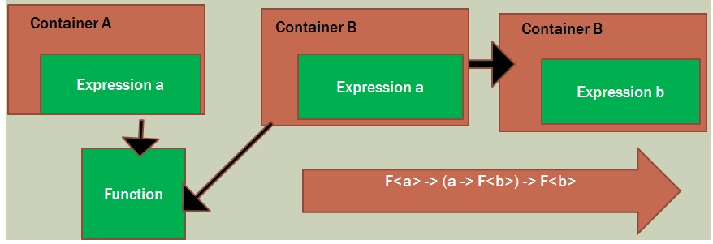

**Bind**

Compose functions that cross multiple combinator libraries

A container produces a function, that a second container uses to move something into itself

---

In English:  bind allows you to take methods from one closure/class and use them on another closure/class as if they belonged there!

Or think of it as making a function that can be used on multiple classes or closures without being a part of the class/closure.

---

**Using Bind in Various Languages**

* C# Extension Methods 
* C# Expression Trees ???
* LINQ SelectMany
* F# <$>
* JS Bind()

---

**Labs**

[C# Lab](./CSharp.md)

[F# Lab](./FSharp.md)

[JS Lab](./JS.md)