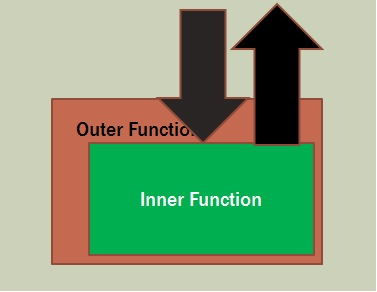

Callbacks

A function that is passed as a parameter into another function

Mathematically think f(g(x))  where g(x) is a variable

**Labs**

[C# Lab](./Csharp.md)

[F# Lab](./FSharp.md)

[JS Lab](./JS.md)

