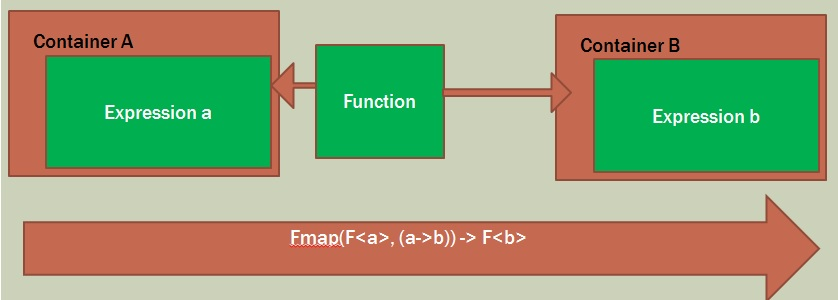

**Catamorphisms**

A catamorphism is a functional concept that replaces looping.

* Map
* Reduce

---

LINQ:  Select(Func<T,U>)

JS: map()

F#:  <$>

---
How Catamorphism Works

A function that moves stuff from one container to another

**Labs**

[C# Catamorphisms](./CSharp.md)

[F# Catamorphisms](./FSharp.md)

[JavaScript Catamorphisms](./JS.md)