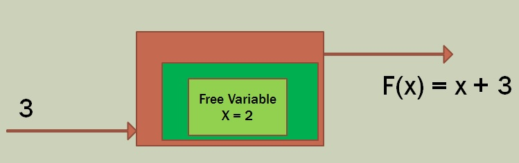
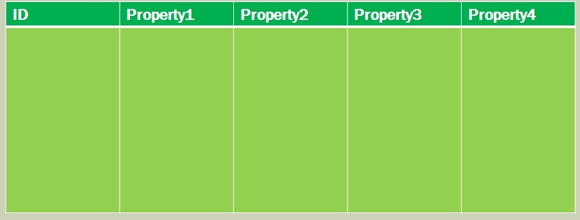
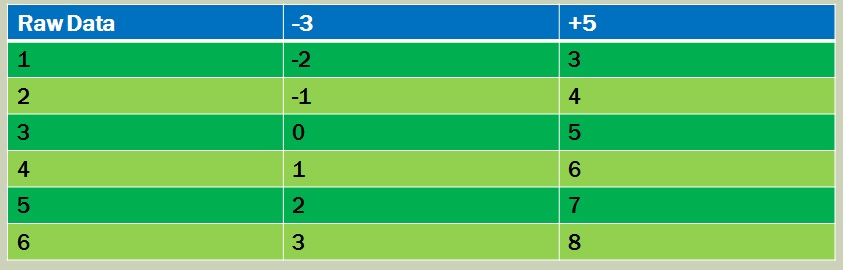

Closures

**Free Variables in Closures**

* A way of using state without side effects

Closures allow you to send state to other functions, like a message

**Labs**

[C# Closures](./CSharp.md)

[F# closures](./FSharp.md)

[JS Closures](./JS.md)

---

**Classes are Columns**

Create an object and define its behaviour

**Closures are rows**

Closures pass state from one function to the next

A different way of looking at things:  start with the data instead of the behaviour, then create tasks to handle the data
The opposite of combinatotrs
The JavaScript community is increasingly turning away from OOP and towards FP because its classes are such a pain

**the Expression Problem**

* Classes = easy to add new types via Inheritance
* Closures = easy to add new methods via Composition

The visitor pattern is used as a solution to TEP in C#
Clojure has a means to solve it

