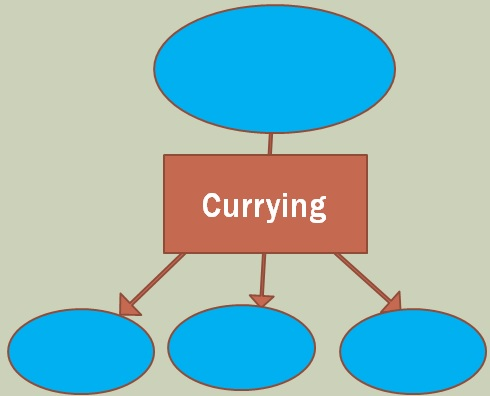

**Currying**

Funny name for a simple idea:  Remember factoring from high school algebra?

From High School
(a^2 + b^2) = (a + b)*(a - b)

Now, with functions
F(x,y) = f(x)*g(y)

Mathematically, ALL functions factor into functions with a single parameter!
---

Basically nested closures  var curry = x => y => x+y
Can use to pass parameters to a callback

What are thse good for? – splitting the logic into small pieces.  Microservices without extra machines
Faster to write, faster to test

---

**Labs**

[csharp](./CSharp.md)

[fsharp](./FSharp.md)

[javascript](./JS.md)
