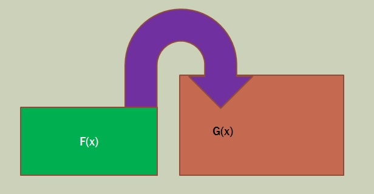
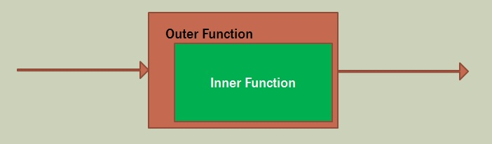

**First Class Functions**

All about stuffing one function into another one

**Nested Functions**

Also useful in procedural code for cleaning up code with function calls that have functions not used anywhere else

Brian Will has some great procedural programming videos
