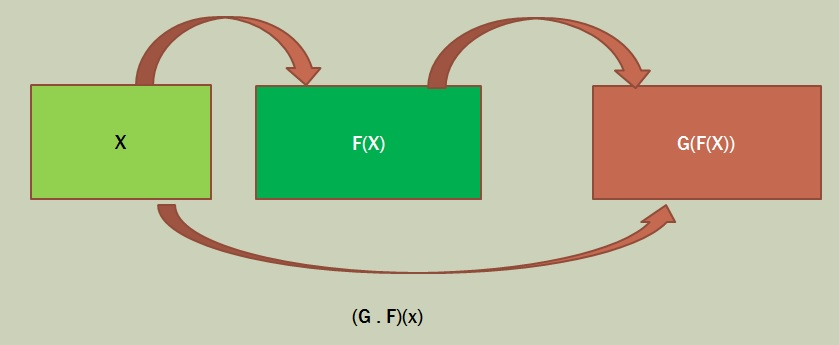
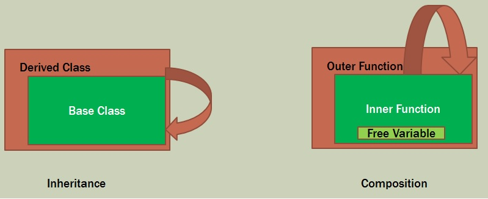
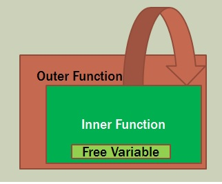

**Function Composition  Y = f(g(x))**

* LINQ and C# Method chaining:  x.FirstOrDefault().ToList()

* C# Func<T> passing in interfaces:  <T> MyFunc(Func<T,U>) {}

* F# <.> operator

**Inheritance vs Composition**

Containers that you put a value into and get a function out of it
Just like the instance of a class

**Closure Polymorphism and Inheritance**

Polymorphism = pass a function into the closure
Inheritance = pass a function into the closure

OOP can replace an if with polymorphism to achieve a more abstract control flow.  Some OO purists don't use ifs at all.  Polymorphism through function composition can also replace the use of if statements.

---

**Labs **

[C# Composition](./CSharp.md)

[F# Composition](./FSharp.md)

[JavaScript Composition](./JS.md)

