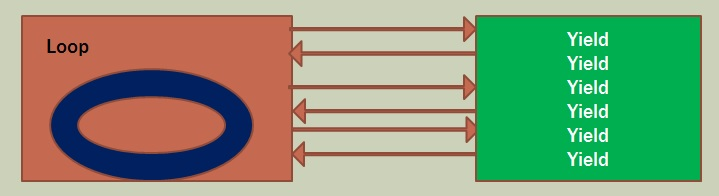

**Generators**

Yield keyword – like return but works inside loops

Allows a function to be evaluated at a later time

Sometimes called Sagas

**Labs**

[C# Generators](./CSharp.md)

[F# Generators](./FSharp.md)

[JavaScript Generators](./JS.md)