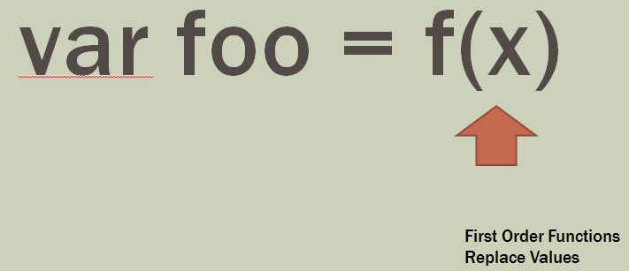

**Abstraction Level 1:  First Order Functions**

Paradigm:  replace values with functions

Procedural Pascal type code
Just functions, no classes yet

---

**Ad Hoc Polymorphism**
* Function overloading
* Operator Overloading
 
Add(x)

Add(x, y)

Add(x, y, z)
