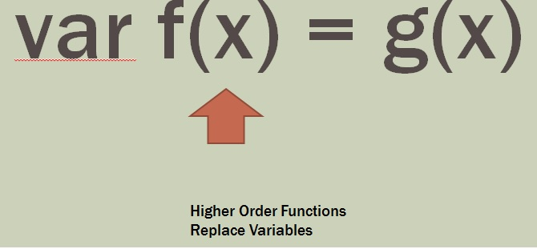

**Abstraction Level 2: Higher Order Functions + Combinator Libraries**

[First Class Functions](./FirstClassFunctions/FirstClassFunctions.md)

[Callbacks](./Callbacks/Callbacks.md)

[Closures](./Closures/Closures.md)

[Function Composition](./FunctionComposition/Composition.md)

[Recursion](./Recursion/Recursion.md)

[Generators](./Generators/Generators.md)

[Catamorphisms](./Catamorphisms/Catamorphism.md)

**What are Combinator Libraries?**
*  LINQ is an example of a combinator library

---
**Porting OO Code to HOF**

1. State variables -> Immutable variables + Pure Functions
2. Classes and Methods -> Closures and Functions
3. Interfaces and Inheritance -> HoFs
4. Loops -> Catamorphisms and Recursion

