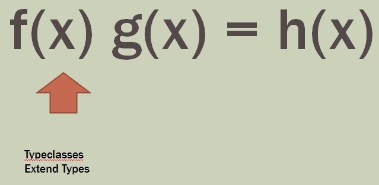

**Abstraction Level 3: Typeclasses, Abstracting over Combinator Libraries**

Code that is generic across multiple combinator libraries

Paradigm:  replace types with functions

[Bind](./Bind/Bind.md)

Algebraic Data Types

Pattern Matching

---

