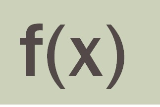
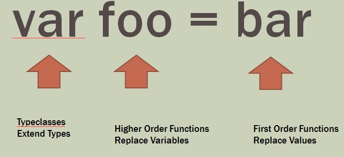
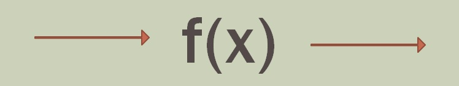

# FPLabs
Functional programming labs for C#/LINQ, F#, and JS

Welcome to Troy's functional programming labs prepared for the North Dallas .NET User Group.  In these labs we will explore the concepts behind functional programming and apply them using C#, JavaScript, and F#.

 Warning: not all of the code in the examples will compile.  Sometimes this is deliberate, sometimes I just say its deliberate!
---

**Why Do We Care?**
* About doing more with less code
* Most FP code has 2x to 10x fewer lines of code than OOP

**Other Reasons We Care**
* Microservices
* Big Data
* Search
* Collections
* Research
* Startups
* All the cool kids are doing it

---

**Where did this come from?**

[Generations of Computing](./Generations/Generations.md)


---

**What happens when you code using FP**

Even Neil DeGrasse Tyson gives you respect!


---
the basics...


**Lists, Collections, Oh My!**

[data](./Data/Data.md)

---

**Abstraction = Using Functions**



* OOP abstracts low level operations into classes.  
* FP abstracts away things like loops and interfaces

Most .NET developers already use some aspects of FP in tools such as LINQ, arrow functions, collections, etc


**Expressions**




**Immutablity**

Pure functions
* No side effects
* Returns the same output for the same input (singleton)



* Static functions = singletons
* Most complexity and bugs in an application are a result of pervasive use of state and side effects of stateful code
* Encapsulation


**Anonymous Functions**

Delegates

Lambdas 
```
()=>
  =>

```  

```
Func<T,Tresult>

```

[Pure Function Lab](./Immutability/Lab.md)

---

**Levels of Abstraction**

1.[ Abstraction level 0](./Level0.md):  no functions

2. [Abstraction Level 1](./Level1.md):  First Order Functions

3. [Abstraction Level 2](./Level2.md): Higher Order Functions + Combinator Libraries

4. [Abstraction Level 3](./Level3.md): Typeclasses, Abstracting over Combinator Libraries

5. Abstraction Level 4:  Abstracting over Typeclasses

---


**The languages**

[Best F# Intro Ever](https://fsharpforfunandprofit.com/posts/fsharp-in-60-seconds/)


[Level 3 Functional Programming Site](https://wiki.haskell.org/Typeclassopedia)

**Resources**

[Programming without IFs](http://michaelfeathers.typepad.com/michael_feathers_blog/2013/11/unconditional-programming.html)

**Advanced Labs**

Create your own big data processor with map/reduce
